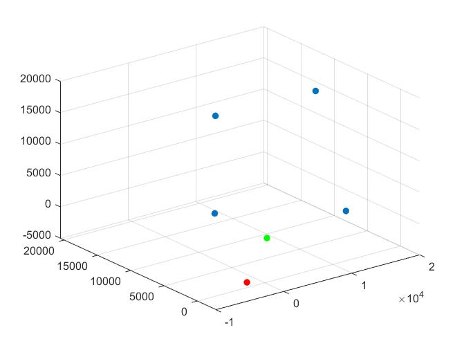

# HW3_11612030

## Problem1

​	The smallest detectable change is $360^{\circ} / 100 = 3.6^{\circ }$


## Problem2

- How to determine the rotation directions:

​      If A leads B, for example, the disk is rotating in a clockwise direction. If B leads A, then the disk is rotating in a counter-clockwise direction.


- Two concerns:

  It is important to know the real position of the axis at all times

  It is necessary to count the number of revolutions completed.

  It should determine the size according to the system it will be integrated into.


## Problem3

​	In my method, I need at least 4 satellites to determine the target location.

​	The following is my code:

```matlab
clear; clc;
GM = 3.986005e14;   % earth's universal gravitational [m^3/s^2]
c = 2.99792458e8;   % speed of light (m/s)
omegae_dot = 7.2921151467e-5;  % earth's rotation rate (rad/sec)
alpha = 1e3;

x = alpha * [0.36, 15.2, 15.3, 12.9];
y = alpha * [7.90, 7.86, 3.4, 20.6];
z = alpha * [2.1, 17.3, 0.3, 7.8];
% b = [1.2, 3.2, 0.7, 1.8];
p = []; % fake p
rp = []; % real p

b = 0;
coordinate=alpha*[1.1, 0.8, 1.4];
init_pos = coordinate;
for i=[1:4]
   %p(i) = calcdistance([x(i), y(i), z(i)], coordinate, b(i) ); 
   rp(i) = realdistance([x(i), y(i), z(i)], coordinate);
end
limitation = 10;

coordinate = [0, 0, 0];
for i=[1:4]
   p(i) = calcdistance([x(i), y(i), z(i)], coordinate, b ); 
   %rp(i) = realdistance([x(i), y(i), z(i)], coordinate);
end


for k=[1:5]
    
mat = ones(4, 4);
for i=[1:4]
    mat(i,1)=(x(i)-coordinate(1))/(p(i) - b);
    mat(i,2)=(y(i)-coordinate(2))/(p(i) - b);
    mat(i,3)=(z(i)-coordinate(3))/(p(i) - b);
end

delta_p = p - rp;
f = inv(mat).*delta_p;
del_v = getF(f);

if del_v <= limitation
    break; 
end


coordinate(1) = coordinate(1) + f(1);
coordinate(2) = coordinate(2) + f(2);
coordinate(3) = coordinate(3) + f(3);
b = b + f(4);
end

scatter3(x,y,z,'filled');
hold on
scatter3(coordinate(1), coordinate(2), coordinate(3), 'r', 'filled');
scatter3(init_pos(1), init_pos(2), init_pos(3), 'g', 'filled');
hold off

function d = getF(f)
    d = f.^2
    d = sqrt(sum(d(:)))
end

function p = realdistance(A, B)
    C = A - B;
    C = C.^2;
    p = sqrt(sum(C(:)));
end

function p = calcdistance( A, B, b)
   c = 2.99792458e8;   % speed of light (m/s)
   C=A-B;
   C=C.^2;
   p = sqrt(sum(C(:))) + c * b;
end
```

​	

​	In the figure, 4 blue points represents the satellites' position. The green point represents the real position of the object and the red point represents the estimate position of the object.  

​	The error is about 4km, so it is not perform well. But I have tried my best.


## Problem 4

