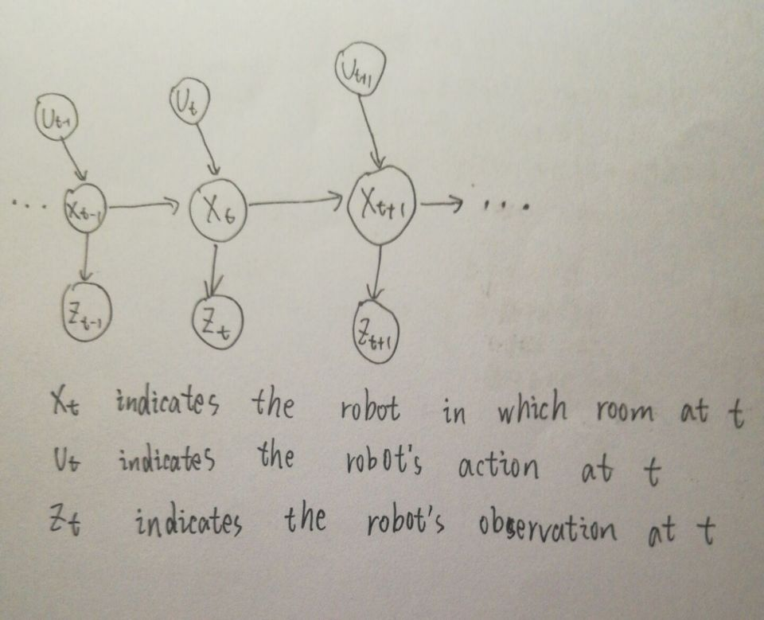

# HW4_11612030

## Problem1

$$
P(open|u) = \sum P(open|u,x')P(x')
$$

namely $ P(open|u) = P(open|u, open) P(open) + P(open|u, closed) P(closed)$

Therefore, $P(open|u) = 1/1 * 5/10 + 8/10 * 5/10 = 0.9$

## Problem2

​	The robot does not know the state of the door initially.So we assigns equal prior probability to the two possible door states:

$bel(x_0 = open) = 0.5, bel(x_0 = closed) = 0.5$

​	The robot’s sensors are noisy. The noise is characterized by the following conditional probabilities:

​	$p(z_t = open | x_t = open) = 0.8$

​	$p(z_t = closed| x_t = open) = 0.2$ 

​	$p(z_t = open | x_t = closed) = 0.3$

​	$p(z_t = closed | x_t = closed) =0.7 ​$

​	Let us assume the robot uses its manipulator to push the door open. If the door is already open, it will remain open. If it is closed, the robot has a 0.7 chance that it will be open afterwards:

​	$p(x_t = open | u_t = push, x_{t-1} = open) = 1$

​	$p(x_t = closed | u_t = push, x_{t-1} = open) = 0$

​	$p(x_t = open | u_t = push, x_{t-1} = closed) =0.7 $

​	$p(x_t = open | u_t = push, x_{t-1} = closed) =0.3 $

​	It can also choose not to use its manipulator, in which case the state of the
world does not change. This is stated by the following conditional probabilities:

​	$p(x_t = open | u_t = do\_nothing, x_{t-1} = open ) = 1$

​	$p(x_t = closed | u_t = do\_nothing, x_{t-1} = open ) = 0​$

​	$p(x_t = open | u_t = do\_nothing, x_{t-1} = closed ) = 0$

​	$p(x_t = closed | u_t = do\_nothing, x_{t-1} = closed ) = 1​$

​	Suppose at time $t = 1$, the robot takes no control action but it senses an open
door. The resulting posterior belief is calculated by the Bayes filter using
the prior belief $bel( x_0 )$, the control $u_1 = do\_nothing$, and the measurement
**sense_open** as input.

   $\overline{bel}$

= $\sum_{x_o} p(x_1 | u_1, x_0) bel(x_0) $

= $p(x_1 | u_1 = do\_nothing, x_0 = open) bel(x_0 = open) \ + \ p(x_1|u_1 =do\_nothing, x_0 = closed) bel(x_0 = closed)$

​	For the hypothesis $x_1 = open​$, we obtain:

  $\overline{bel}(x_1 = open) $  = $1 * 0.5 +0 * 0.5 $ = $0.5$

  $\overline{bel}(x_1 = closed) $ = $0 * 0.5 + 1 * 0.5$ = $0.5$

$bel(x_1) = \eta p(z_1 = open | x_1) \overline{bel}(x_1) $

$bel(x_1 = open) = \eta p(z_1 = open | x_1 = open) \overline{bel}(x_1 = open)$ = $\eta 0.8 * 0.5$ = $\eta 0.4$

$bel(x_1 = closed) = \eta p(z_1 = open | x_1 = closed) \overline{bel}(x_1 = closed)$ = $\eta 0.3 * 0.5$ = $\eta 0.15$

$\eta = (0.4 + 0.15)^{-1} = 20/11$

Hence, we have

$bel(x_1 = open) = 8/11​$

$bel(x_1 = closed) = 3/11$

For $u_2 = push$ and $z_2 = open$ , we get

$\overline{bel}(x_2 = open) = 1*8/11 + 0.7 * 3/11 \approx 0.918$

$\overline{bel}(x_2 = closed) = 0 * 8/11 + 0.3 * 3/11 \approx 0.082$

Therefore,

$bel(x_2 = open) = \eta 0.8 * 0.918 \approx 0.955​$

$bel(x_2 = closed) = \eta 0.3 * 0.082 \approx 0.045$

At this point, the robot believes that with $0.955$ probability the door is open.

## Problem 3

(1) The following figure is the markov model for this problem.

(2) Assume that a indicates the probability of  robot in room1, b indicates the probability of robot in room 2, c indicates the probability of robot in room 3, and d indicates the probability of robot in room 4. 
$$
\left[
 \begin{matrix}
   0.9 & 0 & 0 & 0.1 \\ 0.1 & 0.7 & 0.1 & 0.1 \\
   0 & 0.1 & 0.1 & 0.8  \\ 0.1 & 0.1 & 0.1 & 0.7 
  \end{matrix}   
\right]

\left[
    \begin{matrix}
      a\\ b\\ c\\ d
    \end{matrix}
\right]
=
\left[
 \begin{matrix}
  a\\ b\\ c\\ d
 \end{matrix}
\right]
$$
Finally, we get that $a = b = c = d$

So the robot has the same probability staying in each room.

(3) The probability is $0.25 * 1/1 + 0.25 * 1/3 \approx 0.333$